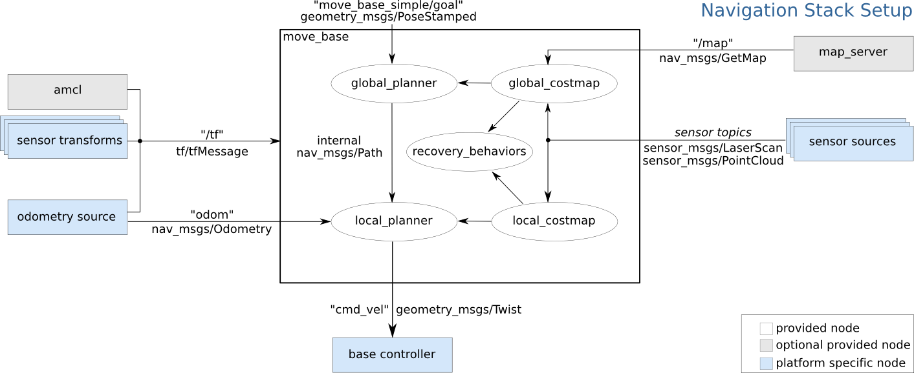
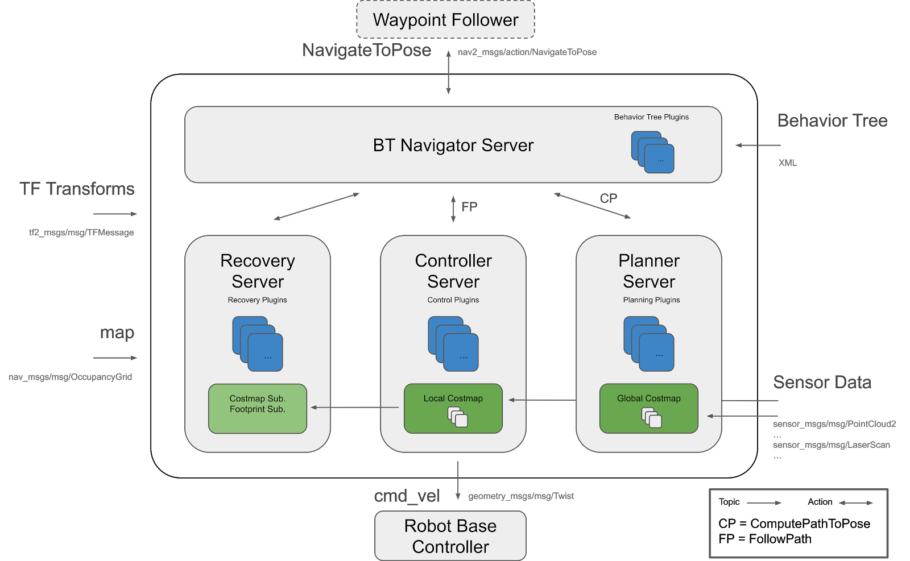
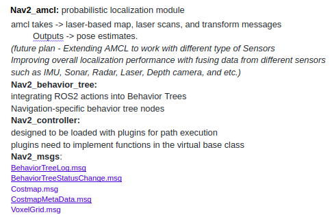
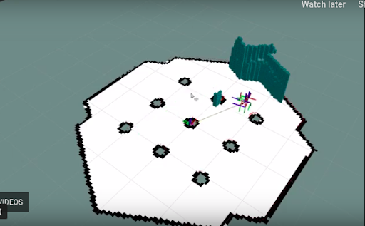

# ROS2 Navigation stack and study for use in our robot

Some key points one of our discussion meetings

* It is important to study navigation2 in detail, to see what is going in and what else is required, ex- behavior trees
* Having messages being exchanged and controllers in process would help us in finalizing the roadmap
* Even though we have Roswan drivers with us, it is not necessary to use previous r2c2 architecture
* See what else functionalities are provided with ros2 for use in future
* Good to look into everything and then decide !

ROS to ROS2 Navigation stack comparison

* Move_base splitted into multiple components
* Ported packages:
1. amcl: Ported to nav2_amcl
2. map_server: Ported to nav2_map_server
3. nav2_planner: Replaces global_planner
4. nav2_controller: Replaces local_planner
5. Navfn: Ported to nav2_navfn_planner
6. DWB: Replaces DWA and ported to ROS2 under
7. nav2_dwb_controller metapackage
8. nav_core: Ported as nav2_core with updates to interfaces
9. costmap_2d: Ported as nav2_costmap_2d

* New packages:
1. nav2_bt_navigator: replaces move_base state machine
2. nav2_lifecycle_manager: Handles the server program lifecycles
3. nav2_waypoint_follower: Can take in many waypoints to execute a complex task through
4. nav2_system_tests: A set of integration tests for CI and basic tutorials in simulation
5. nav2_rviz_plugins: An rviz plugin to control the Navigation2 servers, command, cancel, and navigation with
6. nav2_experimental: Experimental (and incomplete) work for deep reinforement learning controllers
7. navigation2_behavior_trees: wrappers for the behavior tree library to call ROS action servers

ROS2 goals (Foxy) (Can we use something?)
● Support for navigating multi-story buildings 

● Behavior tree plugin support 

● Add support for map zones  

● Traffic lanes and routes 

● Docking support 

● Voxel layer support 

● Support multiple sensor inputs 

● Support for changing maps 

● Waypoint follower demo 

* Ensure a stable, functional SLAM implementation is available for ROS 2 (outside the nav stack)

● Ensure a stable, functional IMU/Odom fusing solution (eg [Robot Localization] (https://github.com/cra-ros-pkg/robot_localization)) is available for ROS2. (outside the nav stack)

● Provide an option/example for launching nav2 using composed nodes 

● Add Auto-localization Action server #1254

# Behavior trees - A basic introduction

Since, ROS2 Navigation2 is based on behaviour tree implementation, it is necessary to understand the basic concepts.

* Mathematical model of plan execution 

● Graphically represented as a directed tree

● Describe switchings between a finite set of tasks in a modular fashion

● Create complex task; without worrying how the simple tasks are implemented

● How different from Finite state machines?

○ Main building block of a behavior is a task rather than a state.

○ Easier to add other controls without disturbing previous architecture

# Detailed ROS2 Navigation 

* Navigation 2 makes use of action servers and ROS2’s low-latency, reliable communication to separate ideas
● Behavior tree is used to orchestrate these tasks: allows Navigation2 to have highly configurable navigation behavior without programming by rearranging tasks in a behavior tree xml file.
● Nav2_bt_navigator:
   ○ replaces move_base at the top level, with an Action interface to call the planner and controller with a configurable tree-based action model
   ○ Action Server and can also be replaced with other implementations
   ○ Behavior Trees to make it possible to have more complex state machines and to add in recovery behaviors as additional Action Servers
● planning, recovery, and controller servers are also action servers that the BT navigator can call to compute

<image3>
  
#  Ros2 navigation stack- what parameters it can take? What else can we put?

  
System Tests:

* Test the integration of several components and subsystems.

● Support modules (Mapping, Perception, Prediction, Localization

● Navigation core (Navigator, Planner, Controller)

● Support modules and navigation core

● Command chain (Mission Planning, Mission Execution, Navigation System, Robot Interface)

# COLA2 messages exchanged

Sensor, actuator messages

● sensor_msgs/Range

● sensor_msgs/NavSatFix

● sensor_msgs/Imu

● sensor_msgs/FluidPressure

● sensor_msgs/Temperature

● sensor_msgs/BatteryState

● sensor_msgs/RelativeHumidity

● /pc_cylinder/water_detected
[std_msgs/Bool]

● geometry_msgs/PoseStamped

● sensor_msgs/Joy

● nav_msgs/Odometry]

● geometry_msgs/Vector3Stamped

● cola2_msgs/Setpoints

● cola2_msgs/BodyForceReq

● diagnostic_msgs/DiagnosticArray

● cola2_msgs/DVLy

● cola2_msgs/Float32Stamped

● cola2_msgs/VehicleStatus

● cola2_msgs/RecoveryAction

● cola2_msgs/BodyVelocityReq

● cola2_msgs/NavSts

● cola2_msgs/CaptainStatus

● cola2_msgs/CaptainStateFeedback

● visualization_msgs/Marker

● Barometer, joystick,leak sensor, depth, maestro polulo motors

**Add ons with ROS2**

● SLAM

● Reinforcemment Learning in obstacle avoidance and navigation

● Vision based DL plugins

● Robot Security 

**(STVL) Using an External Costmap Plugin**

● STVL (another 3D perception plugin similar to the Voxel Layeris), a demonstrative pluginlib plugin and the same process can be followed for other costmap plugins as well as plugin planners, controllers, and recoveries.

**Conclusion**

With behavior trees in navigation2, we have flexibility to add plugins without disrupting the current architecture
We may utilize these with ROS2 Navigation stack.

